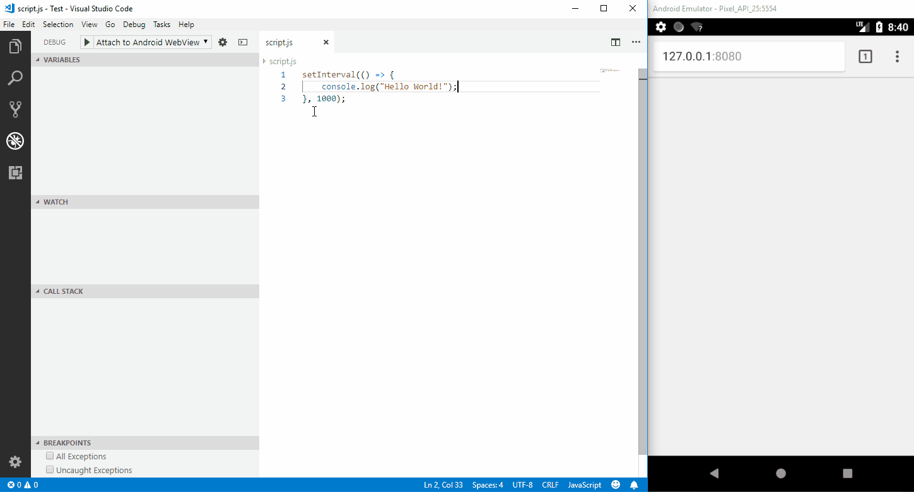

<h1 align="center">
  <br>
    
  <br>
  VS Code - Android WebView Debugging
  <br>
  <br>
</h1>

<h4 align="center">Debug your JavaScript code running in WebViews on any Android device from VS Code.</h4>

<p align="center">
  <a href="https://github.com/mpotthoff/vscode-android-webview-debug/releases"></a>
</p>

A VS Code extension to debug your JavaScript code in the Google Chrome browser or other WebView targets on Android devices, that support the [Chrome DevTools Protocol](https://chromedevtools.github.io/debugger-protocol-viewer/).



## Requirements

### Debugger for Chrome

This extension uses the [Debugger for Chrome](https://github.com/Microsoft/vscode-chrome-debug) extension under the hood.

## Using the debugger

When your launch config is set up, you can debug your project. Pick a launch config from the dropdown on the Debug pane in Code. Press the play button or F5 to start.

### Configuration

Right now the extension only supports attaching to an already running Google Chrome or WebView instance. This can be configured in the `.vscode/launch.json` file in the root directory of your project.

> All configuration options of the `attach` configuration of the [Debugger for Chrome](https://github.com/Microsoft/vscode-chrome-debug#attach) extension are supported.

You can optionally specify a port to use for the debugging connection or let the extension automatically choose an unsued one.

It is possible to specify the device and/or the application to attach to. If multiple possible instances are found the extension will ask you to choose one.

An example `launch.json` file:
```json
{
    "version": "0.2.0",
    "configurations": [
        {
            "type": "android-webview",
            "request": "attach",
            "name": "Attach to Android WebView",
            "application": "com.android.chrome",
            "webRoot": "${workspaceFolder}",
            "urlFilter": "http://example.com/*"
        }
    ]
}
```

### All contributed configuration fields

* `device`: The serial of the device to use. It can be found using `adb devices`.
* `application`: The package name of the application to connect to. For example `com.android.chrome`.

## Extension Settings

This extension contributes the following settings:

* `android-webview-debug.adbPath`: Specifies the path to the ADB executable.

## Troubleshooting

### Failed to locate ADB executable.

The ADB executable was not found. Usually it should be on the PATH environment variable. You can also specify it manually using the `android-webview-debug.adbPath` configuration parameter.

### No WebViews found

Ensure that the device is connected and that the Android application is a debug build or WebView debugging is enabled. You can always find the available WebViews by visiting `chrome://inspect/#devices` in Google Chrome.

### No devices found

Ensure that USB Debugging is enabled on your Android device and that ADB can find it. You can find a list of connected devices using the command `adb devices`.